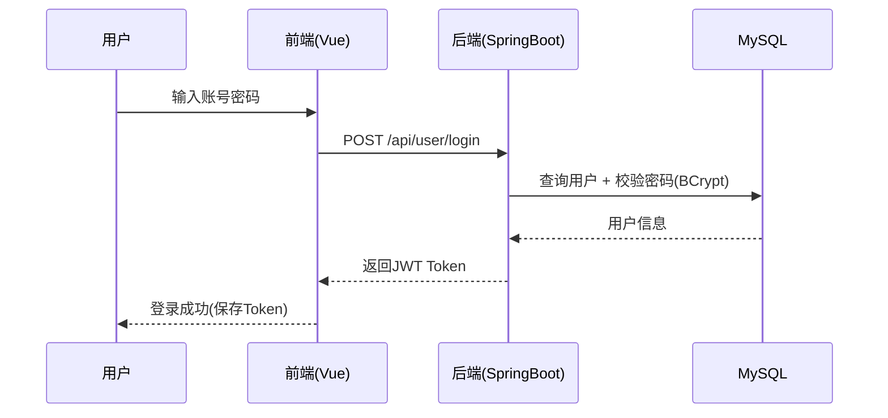
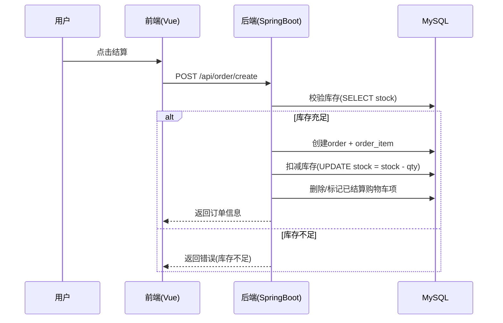
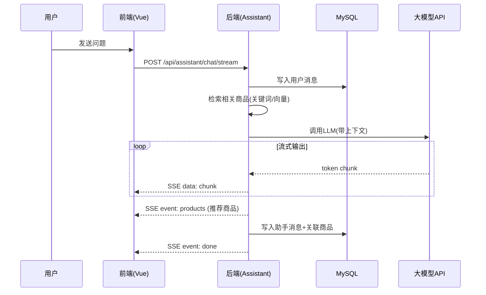

# 商城智能助手系统设计文档

## 1. 项目概述

### 1.1 项目背景
本项目是一个基于SpringBoot和Vue3的电商平台，集成大模型智能助手功能，为购物用户提供智能化的购物咨询和问题解答服务。

### 1.2 项目目标
- 构建完整的电商购物系统
- 集成大模型API实现智能对话功能
- 使用RAG（检索增强生成）技术提供精准的商品信息查询
- 提供良好的用户体验和交互界面

### 1.3 技术栈

**后端技术栈：**
- Spring Boot 2.7+ / 3.0+
- Spring Cloud（可选）
- MyBatis Plus / JPA
- MySQL 8.0+
- Redis（缓存）
- Vector Database（向量数据库，用于RAG）
- HTTP Client（调用大模型API）

**前端技术栈：**
- Vue 3
- TypeScript
- Element Plus / Ant Design Vue
- Axios
- Pinia（状态管理）
- WebSocket（实时对话）

**AI技术栈：**
- 大模型API（支持OpenAI、通义千问、文心一言等）
- Embedding模型（文本向量化）
- 向量数据库（Milvus / Chroma / FAISS）
- LangChain / LlamaIndex（RAG框架，可选）

## 2. 系统架构设计

### 2.1 整体架构

```
┌─────────────────────────────────────────────────────────────┐
│                        前端层 (Vue3)                         │
│  ┌──────────────┐  ┌──────────────┐  ┌──────────────┐      │
│  │  商品浏览    │  │  购物车      │  │  智能助手    │      │
│  │  订单管理    │  │  用户中心    │  │  对话界面    │      │
│  └──────────────┘  └──────────────┘  └──────────────┘      │
└─────────────────────────────────────────────────────────────┘
                            │
                    ┌───────┴───────┐
                    │   HTTP/WS     │
                    └───────┬───────┘
┌─────────────────────────────────────────────────────────────┐
│                    API网关层 (Spring Boot)                   │
│  ┌──────────────┐  ┌──────────────┐  ┌──────────────┐      │
│  │  用户服务    │  │  商品服务    │  │  订单服务    │      │
│  └──────────────┘  └──────────────┘  └──────────────┘      │
│  ┌──────────────────────────────────────────────────────┐  │
│  │              智能助手服务 (AI Service)                │  │
│  │  ┌──────────┐  ┌──────────┐  ┌──────────┐          │  │
│  │  │对话管理  │  │ RAG检索  │  │大模型调用│          │  │
│  │  └──────────┘  └──────────┘  └──────────┘          │  │
│  └──────────────────────────────────────────────────────┘  │
└─────────────────────────────────────────────────────────────┘
                            │
        ┌───────────────────┼───────────────────┐
        │                   │                   │
┌───────▼──────┐  ┌─────────▼────────┐  ┌──────▼──────────┐
│   MySQL      │  │   Redis Cache    │  │  Vector DB      │
│  (业务数据)  │  │   (会话缓存)     │  │  (商品向量)     │
└──────────────┘  └──────────────────┘  └─────────────────┘
                            │
                    ┌───────▼────────┐
                    │   大模型API     │
                    │ (OpenAI/通义等) │
                    └────────────────┘
```

### 2.2 模块划分

#### 2.2.1 业务模块
1. **用户模块（User Module）**
   - 用户注册/登录
   - 用户信息管理
   - 收货地址管理

2. **商品模块（Product Module）**
   - 商品分类管理
   - 商品信息管理
   - 商品搜索
   - 商品详情

3. **订单模块（Order Module）**
   - 购物车管理
   - 订单创建
   - 订单查询
   - 订单支付

4. **智能助手模块（AI Assistant Module）**
   - 对话管理
   - 意图识别
   - RAG检索
   - 大模型调用
   - 上下文管理

#### 2.2.2 基础模块
1. **认证授权模块**
   - JWT Token认证
   - 权限管理

2. **文件服务模块**
   - 图片上传
   - 文件存储

3. **消息通知模块**
   - 站内消息
   - 订单通知

### 2.3 关键业务流程设计

#### 2.3.1 登录鉴权流程（JWT）
- **登录**：用户提交用户名/密码 → 后端校验（BCrypt）→ 生成JWT（包含userId/username/过期时间）→ 前端保存（localStorage）
- **鉴权**：前端每次请求携带 `Authorization: Bearer <token>` → 后端拦截器校验签名与过期时间 → 放行或返回401



#### 2.3.2 购物车→创建订单流程
- **添加购物车**：若同一用户同一商品已存在则数量累加；否则新增记录
- **创建订单**：从购物车生成订单与订单项 → 计算总价 → 扣减库存（需校验库存）→ 清理已结算购物车项
- **取消订单**：状态变更为取消 → 恢复库存



#### 2.3.3 智能助手对话流程（SSE流式）
- 前端发起对话请求（携带sessionId可续聊）
- 后端创建/获取会话，记录用户消息
- 检索相关商品（当前实现：关键词检索；可升级：向量检索）
- 构建Prompt并调用大模型
- 通过SSE逐段返回文本；在结束事件中返回推荐商品列表
- 记录助手消息与关联商品



## 3. 数据库设计

### 3.1 业务数据库（MySQL）

#### 3.1.1 用户表（user）
```sql
CREATE TABLE `user` (
  `id` BIGINT PRIMARY KEY AUTO_INCREMENT,
  `username` VARCHAR(50) UNIQUE NOT NULL,
  `password` VARCHAR(255) NOT NULL,
  `email` VARCHAR(100),
  `phone` VARCHAR(20),
  `avatar` VARCHAR(255),
  `status` TINYINT DEFAULT 1 COMMENT '1:正常 0:禁用',
  `create_time` DATETIME DEFAULT CURRENT_TIMESTAMP,
  `update_time` DATETIME DEFAULT CURRENT_TIMESTAMP ON UPDATE CURRENT_TIMESTAMP
);
```

#### 3.1.2 商品表（product）
```sql
CREATE TABLE `product` (
  `id` BIGINT PRIMARY KEY AUTO_INCREMENT,
  `name` VARCHAR(200) NOT NULL,
  `description` TEXT COMMENT '商品描述，用于RAG检索',
  `category_id` BIGINT,
  `price` DECIMAL(10,2) NOT NULL,
  `stock` INT DEFAULT 0,
  `image_url` VARCHAR(500),
  `detail_images` TEXT COMMENT 'JSON格式详情图片',
  `specs` TEXT COMMENT '商品规格，JSON格式',
  `status` TINYINT DEFAULT 1 COMMENT '1:上架 0:下架',
  `vector_id` VARCHAR(100) COMMENT '向量数据库ID',
  `create_time` DATETIME DEFAULT CURRENT_TIMESTAMP,
  `update_time` DATETIME DEFAULT CURRENT_TIMESTAMP ON UPDATE CURRENT_TIMESTAMP,
  INDEX `idx_category` (`category_id`),
  INDEX `idx_status` (`status`)
);
```

#### 3.1.3 商品分类表（category）
```sql
CREATE TABLE `category` (
  `id` BIGINT PRIMARY KEY AUTO_INCREMENT,
  `name` VARCHAR(100) NOT NULL,
  `parent_id` BIGINT DEFAULT 0,
  `level` TINYINT DEFAULT 1,
  `sort_order` INT DEFAULT 0,
  `create_time` DATETIME DEFAULT CURRENT_TIMESTAMP
);
```

#### 3.1.4 订单表（order）
```sql
CREATE TABLE `order` (
  `id` BIGINT PRIMARY KEY AUTO_INCREMENT,
  `order_no` VARCHAR(50) UNIQUE NOT NULL,
  `user_id` BIGINT NOT NULL,
  `total_amount` DECIMAL(10,2) NOT NULL,
  `status` TINYINT DEFAULT 0 COMMENT '0:待支付 1:已支付 2:已发货 3:已完成 4:已取消',
  `address_id` BIGINT,
  `create_time` DATETIME DEFAULT CURRENT_TIMESTAMP,
  `update_time` DATETIME DEFAULT CURRENT_TIMESTAMP ON UPDATE CURRENT_TIMESTAMP,
  INDEX `idx_user_id` (`user_id`),
  INDEX `idx_order_no` (`order_no`)
);
```

#### 3.1.5 订单项表（order_item）
```sql
CREATE TABLE `order_item` (
  `id` BIGINT PRIMARY KEY AUTO_INCREMENT,
  `order_id` BIGINT NOT NULL,
  `product_id` BIGINT NOT NULL,
  `product_name` VARCHAR(200),
  `quantity` INT NOT NULL,
  `price` DECIMAL(10,2) NOT NULL,
  `create_time` DATETIME DEFAULT CURRENT_TIMESTAMP
);
```

#### 3.1.6 购物车表（cart）
```sql
CREATE TABLE `cart` (
  `id` BIGINT PRIMARY KEY AUTO_INCREMENT,
  `user_id` BIGINT NOT NULL,
  `product_id` BIGINT NOT NULL,
  `quantity` INT DEFAULT 1,
  `create_time` DATETIME DEFAULT CURRENT_TIMESTAMP,
  UNIQUE KEY `uk_user_product` (`user_id`, `product_id`)
);
```

#### 3.1.7 对话会话表（conversation）
```sql
CREATE TABLE `conversation` (
  `id` BIGINT PRIMARY KEY AUTO_INCREMENT,
  `user_id` BIGINT NOT NULL,
  `session_id` VARCHAR(100) NOT NULL,
  `title` VARCHAR(200) COMMENT '会话标题',
  `create_time` DATETIME DEFAULT CURRENT_TIMESTAMP,
  `update_time` DATETIME DEFAULT CURRENT_TIMESTAMP ON UPDATE CURRENT_TIMESTAMP,
  INDEX `idx_user_id` (`user_id`),
  INDEX `idx_session_id` (`session_id`)
);
```

#### 3.1.8 对话消息表（conversation_message）
```sql
CREATE TABLE `conversation_message` (
  `id` BIGINT PRIMARY KEY AUTO_INCREMENT,
  `conversation_id` BIGINT NOT NULL,
  `role` TINYINT NOT NULL COMMENT '1:用户 2:助手',
  `content` TEXT NOT NULL,
  `related_products` TEXT COMMENT '相关商品ID，JSON格式',
  `create_time` DATETIME DEFAULT CURRENT_TIMESTAMP,
  INDEX `idx_conversation_id` (`conversation_id`)
);
```

#### 3.1.9 收货地址表（address）（建议补齐）
> 说明：订单创建通常需要选择收货地址。本表用于保存用户常用地址信息；也便于扩展“默认地址”。

```sql
CREATE TABLE `address` (
  `id` BIGINT PRIMARY KEY AUTO_INCREMENT,
  `user_id` BIGINT NOT NULL,
  `receiver_name` VARCHAR(50) NOT NULL,
  `receiver_phone` VARCHAR(20) NOT NULL,
  `province` VARCHAR(50) NOT NULL,
  `city` VARCHAR(50) NOT NULL,
  `district` VARCHAR(50) NOT NULL,
  `detail` VARCHAR(255) NOT NULL,
  `is_default` TINYINT DEFAULT 0 COMMENT '1:默认 0:非默认',
  `create_time` DATETIME DEFAULT CURRENT_TIMESTAMP,
  `update_time` DATETIME DEFAULT CURRENT_TIMESTAMP ON UPDATE CURRENT_TIMESTAMP,
  INDEX `idx_user_id` (`user_id`)
);
```

#### 3.1.10 （可选）商品搜索索引与检索字段建议
- **索引建议**：对 `product.status`、`product.category_id`、`product.price` 建立组合索引以优化筛选；若使用MySQL全文检索，可对 `name/description` 建立 FULLTEXT。
- **数据冗余**：`order_item.product_name/price` 建议冗余保存下单时快照，避免商品后续改名/改价影响历史订单展示。

### 3.2 向量数据库（用于RAG）

向量数据库存储商品描述的向量化表示，用于语义搜索。

**存储结构：**
- Collection: `products`
- Fields:
  - `id`: 商品ID（与MySQL商品表关联）
  - `vector`: 商品描述的向量（通过Embedding模型生成）
  - `text`: 原始文本（商品名称 + 描述 + 规格）
  - `metadata`: JSON格式，包含category_id, price等信息

## 4. 智能助手核心设计

### 4.1 系统流程

```
用户问题
    │
    ▼
┌──────────────┐
│  意图识别    │ ──→ 商品咨询/订单查询/通用对话
└──────────────┘
    │
    ▼
┌──────────────┐
│  RAG检索     │ ──→ 从向量数据库检索相关商品信息
│  (商品相关)  │
└──────────────┘
    │
    ▼
┌──────────────┐
│  上下文构建  │ ──→ 组装系统提示词 + 检索结果 + 历史对话
└──────────────┘
    │
    ▼
┌──────────────┐
│  调用大模型  │ ──→ 生成回答
└──────────────┘
    │
    ▼
┌──────────────┐
│  后处理      │ ──→ 提取推荐商品、格式化回答
└──────────────┘
    │
    ▼
返回给用户
```

### 4.2 RAG实现方案

#### 4.2.1 数据预处理
1. **商品文本构建**
   ```
   文本内容 = 商品名称 + " " + 商品描述 + " " + 商品分类 + " " + 商品规格
   ```

2. **向量化**
   - 使用Embedding模型（如text-embedding-ada-002、text2vec等）
   - 将商品文本转换为向量
   - 存储到向量数据库

3. **数据同步**
   - 商品新增/更新时，同步更新向量数据库
   - 定时任务同步全量数据

#### 4.2.2 检索流程
1. 用户问题向量化
2. 在向量数据库中执行相似度搜索（余弦相似度）
3. 返回Top-K个最相关的商品信息
4. 将检索结果作为上下文输入大模型

#### 4.2.4 当前实现口径与可扩展方案（与代码一致）
为保证系统可运行与便于毕设落地，当前版本在检索层采用**关键词匹配/规则检索**实现“可用的商品推荐闭环”，并预留Embedding与向量库接口，后续可平滑升级为向量语义检索：
- **当前实现（已落地）**
  - 基于用户问题进行分词/关键词提取（或简单包含匹配）
  - 在MySQL商品表（`name/description/specs`等字段）中执行LIKE/全文检索（实现方式可因代码而异）
  - 选取Top-K作为候选商品，返回给前端展示
- **升级实现（建议/扩展）**
  - 新增Embedding服务：商品与用户问题向量化
  - 使用向量数据库（Chroma/Milvus/pgvector）进行Top-K语义召回
  - 结合业务过滤（库存、上架状态、价格区间、类目）进行重排

> 说明：论文答辩中建议强调“分阶段实现策略”：先以关键词检索完成业务闭环与可演示版本，再升级向量检索提升语义召回质量。

#### 4.2.3 Prompt设计

```
你是一个专业的电商购物助手，你的任务是帮助用户解答购物相关问题。

当前商品信息：
{从RAG检索到的商品信息}

用户历史对话：
{最近5-10轮对话历史}

当前用户问题：{用户输入}

请根据以上信息，为用户提供准确、友好的回答。如果需要推荐商品，请明确指出商品名称和价格。
```

### 4.3 对话管理

#### 4.3.1 会话管理
- 每个用户可以有多个对话会话
- 使用session_id区分不同会话
- 会话包含完整的对话历史

#### 4.3.2 上下文窗口管理
- 限制上下文长度（如最近10轮对话）
- 对于长对话，使用滑动窗口或总结压缩
- 重要信息（如用户偏好）持久化存储

### 4.4 意图识别（可选增强）

简单的关键词匹配或使用分类模型：
- **商品咨询**：询问商品信息、价格、规格等
- **订单查询**：查询订单状态、物流信息
- **购物建议**：推荐商品、比较商品
- **通用对话**：问候、闲聊等

## 5. API设计

### 5.1 智能助手相关API

#### 5.1.1 发送消息
```
POST /api/assistant/chat
Request:
{
  "sessionId": "会话ID（可选，新建会话时不传）",
  "message": "用户消息内容"
}

Response:
{
  "code": 200,
  "data": {
    "sessionId": "会话ID",
    "message": "助手回复内容",
    "relatedProducts": [商品列表],
    "messageId": "消息ID"
  }
}
```

#### 5.1.2 获取会话列表
```
GET /api/assistant/conversations?page=1&size=10

Response:
{
  "code": 200,
  "data": {
    "list": [
      {
        "id": "会话ID",
        "title": "会话标题",
        "lastMessage": "最后一条消息",
        "updateTime": "更新时间"
      }
    ],
    "total": 100
  }
}
```

#### 5.1.3 获取会话历史
```
GET /api/assistant/conversation/{sessionId}/messages

Response:
{
  "code": 200,
  "data": [
    {
      "id": "消息ID",
      "role": "user/assistant",
      "content": "消息内容",
      "createTime": "创建时间"
    }
  ]
}
```

#### 5.1.4 删除会话
```
DELETE /api/assistant/conversation/{sessionId}
```

### 5.2 用户认证与用户信息API（建议补齐）
- **POST `/api/user/register`**：注册（username/password/email等）
- **POST `/api/user/login`**：登录（返回JWT）
- **GET `/api/user/info`**：获取当前登录用户信息（需鉴权）

### 5.3 商品相关API（建议补齐）
- **GET `/api/products`**：商品列表（支持分页、类目、价格区间、关键词）
- **GET `/api/products/{id}`**：商品详情
- **GET `/api/products/search`**：商品搜索（关键词/排序）

### 5.4 购物车API（建议补齐）
- **POST `/api/cart/add`**：添加商品到购物车
- **GET `/api/cart/list`**：获取购物车列表（包含商品详情）
- **PUT `/api/cart/{cartId}`**：更新数量（校验库存）
- **DELETE `/api/cart/{cartId}`**：删除某条购物车记录
- **DELETE `/api/cart/clear`**：清空购物车

### 5.5 订单API（建议补齐）
- **POST `/api/order/create`**：创建订单（从购物车结算）
- **GET `/api/order/list`**：订单列表（可按status筛选）
- **GET `/api/order/{orderId}`**：订单详情
- **PUT `/api/order/{orderId}/cancel`**：取消订单（恢复库存）
- **PUT `/api/order/{orderId}/pay`**：支付订单（模拟支付）

### 5.6 收货地址API（与地址表配套，建议补齐）
- **POST `/api/address`**：新增地址
- **GET `/api/address/list`**：地址列表
- **PUT `/api/address/{id}`**：修改地址
- **DELETE `/api/address/{id}`**：删除地址
- **PUT `/api/address/{id}/default`**：设为默认地址

## 6. 前端页面设计

### 6.1 智能助手界面

**组件结构：**
```
ChatAssistant.vue
├── ConversationList.vue (左侧会话列表)
├── ChatWindow.vue (中间对话窗口)
│   ├── MessageList.vue (消息列表)
│   └── MessageInput.vue (输入框)
└── ProductRecommendation.vue (右侧商品推荐，可选)
```

**功能特性：**
- 实时对话（WebSocket或轮询）
- 消息流式输出（SSE）
- 商品卡片展示（点击可跳转商品详情）
- 会话历史管理
- 支持图片、链接等富文本展示

### 6.2 主要页面
- 首页（商品展示、分类导航）
- 商品列表页
- 商品详情页
- 购物车页面
- 订单页面
- 用户中心
- 智能助手页面（新增）

## 7. 技术实现要点

### 7.1 大模型API集成

支持多种大模型提供商：
- OpenAI API
- 通义千问（阿里云）
- 文心一言（百度）
- 讯飞星火
- 本地部署的模型（如Ollama）

**抽象接口：**
```java
public interface LLMService {
    String chat(String prompt, List<Message> history);
    Stream<String> chatStream(String prompt, List<Message> history);
}
```

### 7.2 向量数据库选择

**方案对比：**

| 方案 | 优点 | 缺点 | 适用场景 |
|------|------|------|----------|
| Milvus | 功能强大、性能好 | 部署复杂 | 生产环境 |
| Chroma | 轻量、易用 | 性能一般 | 开发/小规模 |
| FAISS | 速度快 | 需要自己管理持久化 | 研究/原型 |
| PostgreSQL + pgvector | 集成方便 | 性能一般 | 已有PG环境 |

**推荐：** 开发阶段使用Chroma，生产环境使用Milvus

### 7.3 Embedding模型选择

- **在线API**：OpenAI text-embedding-ada-002、通义千问Embedding
- **本地模型**：text2vec-large-chinese、bge-large-zh-v1.5

### 7.4 性能优化

1. **缓存策略**
   - Redis缓存常见问题答案
   - 缓存商品向量（避免重复计算）

2. **异步处理**
   - 向量检索异步化
   - 大模型调用异步化

3. **流式输出**
   - 使用SSE实现流式响应
   - 提升用户体验

## 8. 部署方案

### 8.1 开发环境
- MySQL + Redis（Docker）
- Chroma向量数据库（本地）
- 大模型API（使用在线API）

### 8.2 生产环境
- Spring Boot应用部署到服务器
- MySQL主从/集群
- Redis集群
- Milvus向量数据库（独立部署）
- Nginx反向代理
- Vue3应用打包后部署到Nginx

### 8.3 Docker Compose部署示例
```yaml
version: '3.8'
services:
  mysql:
    image: mysql:8.0
    # ...
  redis:
    image: redis:7-alpine
    # ...
  milvus:
    image: milvusdb/milvus:latest
    # ...
  backend:
    build: ./backend
    # ...
  frontend:
    build: ./frontend
    # ...
```

## 9. 项目结构

### 9.1 后端结构（Spring Boot）
```
mall-backend/
├── src/main/java/com/mall/
│   ├── MallApplication.java
│   ├── config/              # 配置类
│   ├── controller/          # 控制器
│   │   ├── ProductController.java
│   │   ├── OrderController.java
│   │   └── AssistantController.java
│   ├── service/             # 服务层
│   │   ├── ProductService.java
│   │   ├── OrderService.java
│   │   └── assistant/
│   │       ├── AssistantService.java
│   │       ├── LLMService.java
│   │       ├── RAGService.java
│   │       └── EmbeddingService.java
│   ├── mapper/              # MyBatis Mapper
│   ├── entity/              # 实体类
│   ├── dto/                 # 数据传输对象
│   └── utils/               # 工具类
└── src/main/resources/
    └── application.yml
```

### 9.2 前端结构（Vue3）
```
mall-frontend/
├── src/
│   ├── main.ts
│   ├── App.vue
│   ├── router/              # 路由
│   ├── store/               # Pinia状态管理
│   ├── views/               # 页面
│   │   ├── Home.vue
│   │   ├── ProductList.vue
│   │   ├── ProductDetail.vue
│   │   ├── Cart.vue
│   │   ├── Order.vue
│   │   └── Assistant.vue    # 智能助手页面
│   ├── components/          # 组件
│   │   └── assistant/
│   │       ├── ChatWindow.vue
│   │       ├── ConversationList.vue
│   │       └── MessageItem.vue
│   ├── api/                 # API接口
│   └── utils/               # 工具函数
└── package.json
```

## 10. 开发计划

### 第一阶段：基础功能（2周）
- [ ] 搭建Spring Boot项目框架
- [ ] 搭建Vue3项目框架
- [ ] 实现用户、商品、订单基础功能
- [ ] 数据库设计与创建

### 第二阶段：智能助手核心（2周）
- [ ] 集成大模型API
- [ ] 实现向量数据库集成
- [ ] 实现RAG检索功能
- [ ] 实现对话管理功能

### 第三阶段：前端开发（1.5周）
- [ ] 开发智能助手前端页面
- [ ] 实现实时对话功能
- [ ] 优化用户体验

### 第四阶段：测试与优化（1周）
- [ ] 功能测试
- [ ] 性能优化
- [ ] 文档完善

## 11. 风险评估与应对

### 11.1 技术风险
- **大模型API调用成本**：使用限流、缓存降低调用频率
- **向量数据库性能**：选择合适的技术方案，做好索引优化
- **响应速度**：使用异步、流式输出提升体验

### 11.2 数据风险
- **数据同步**：确保MySQL和向量数据库数据一致性
- **数据安全**：敏感信息脱敏处理

## 12. 后续扩展方向

1. **多模态支持**：支持图片识别、商品图片搜索
2. **个性化推荐**：基于用户历史行为推荐
3. **语音交互**：语音输入和语音输出
4. **知识图谱**：构建商品知识图谱，增强推理能力
5. **多语言支持**：支持多语言对话

---

## 13. 测试方案（本科毕设重点）

### 13.1 测试目标与范围
- **目标**：验证核心业务闭环（登录→浏览→购物车→下单→支付→查询）与智能助手闭环（建会话→SSE对话→推荐商品→历史管理）稳定可用。
- **范围**：后端接口功能测试、前端交互验证、接口联调、异常与边界测试、基础性能测试与安全性检查。

### 13.2 测试策略
- **单元测试（建议）**：Service层关键方法（库存扣减、订单状态流转、JWT解析）
- **接口测试（必做）**：使用Postman/Apifox对REST API进行验证
- **集成测试**：前后端联调，验证鉴权、分页、事务一致性、SSE流式输出
- **回归测试**：功能变更后对关键路径重复测试

### 13.3 代表性测试用例（示例）

#### 用例1：登录成功
- **前置**：用户已注册
- **输入**：正确用户名/密码
- **期望**：返回200；响应包含token；后续携带token访问受保护接口成功

#### 用例2：登录失败（密码错误）
- **输入**：正确用户名 + 错误密码
- **期望**：返回明确错误码与提示；不返回token

#### 用例3：创建订单库存不足
- **前置**：某商品库存=1；购物车购买数量=2
- **步骤**：调用创建订单接口
- **期望**：创建失败；库存不被扣减；购物车数据不丢失；返回“库存不足”提示

#### 用例4：SSE流式对话正常结束
- **步骤**：调用 `/api/assistant/chat/stream` 并持续读取事件流
- **期望**：持续收到 `data:`；结束时收到 `event: products` 与 `event: done`；会话历史可查询到本轮消息

### 13.4 性能与稳定性测试（基础）
- **并发建议**：使用JMeter/压测工具对商品列表、订单列表做并发压测；对对话接口关注超时与限流策略。
- **关注指标**：P95响应时间、错误率、CPU/内存、数据库慢查询。

## 14. 安全设计与异常处理

### 14.1 鉴权与权限
- 采用JWT无状态认证；拦截器统一校验
- 接口按“需登录/无需登录”区分；避免越权读取他人订单/会话

### 14.2 密码与敏感信息保护
- 密码使用BCrypt单向加密存储
- 大模型API Key、数据库密码等通过环境变量/配置文件管理，避免硬编码与泄漏
- 日志脱敏：不记录明文密码、不输出完整token与key

### 14.3 通用异常处理与错误码
- 统一响应结构（code/message/data）
- 对参数校验、鉴权失败、业务异常（库存不足）、系统异常（DB/网络）分层处理

### 14.4 内容安全（智能助手）
- 基础策略：敏感词过滤、提示词约束、拒答策略（涉政涉暴等）
- 降级策略：模型超时/限流时返回可执行建议（重试/换问法/转人工）

## 15. 部署与运行说明（可直接放论文“运行环境与部署”章节）

### 15.1 配置项说明（示例）
- **MySQL**：url/username/password
- **Redis**：host/port/password（可选）
- **JWT**：secret、过期时间
- **LLM**：provider、apiKey、baseUrl、model、timeout
- **RAG**：topK、检索策略（keyword/vector）

### 15.2 启动步骤（概述）
- 启动基础依赖：MySQL、Redis（可用Docker）
- 执行SQL建表脚本并初始化数据（商品、类目等）
- 启动后端Spring Boot（检查端口与健康接口）
- 安装前端依赖并启动/打包，Nginx部署静态资源并反向代理后端API

### 15.3 常见问题与排查
- **401未授权**：检查前端是否携带 `Authorization` 请求头；token是否过期
- **SSE不返回**：检查代理是否关闭buffer（Nginx需配置）、后端是否超时
- **推荐商品为空**：检查商品数据、检索字段、TopK参数

## 16. 用户使用手册（简版）
- **注册/登录**：注册后登录，获取token并自动保存
- **购物流程**：浏览商品 → 加入购物车 → 结算创建订单 → 支付 → 在订单列表查看状态
- **智能助手**：进入助手页面 → 新建会话 → 提问（支持流式输出）→ 查看推荐商品卡片并跳转详情

## 附录

### A. 参考技术文档
- Spring Boot官方文档
- Vue 3官方文档
- LangChain文档
- Milvus文档

### B. 关键依赖版本
- Spring Boot: 2.7.18 或 3.1.0+
- Vue: 3.3.0+
- JDK: 17+
- Node.js: 18+

### 1.4 术语与缩略语
- **LLM（Large Language Model）**：大语言模型，用于生成式对话与文本理解。
- **RAG（Retrieval-Augmented Generation）**：检索增强生成，将外部检索结果作为上下文输入LLM以提升准确性。
- **Embedding（向量化）**：将文本映射为向量表示，便于进行语义相似度检索。
- **SSE（Server-Sent Events）**：服务端向客户端单向推送的流式通信协议，适合逐段输出模型回复。
- **JWT（JSON Web Token）**：无状态认证令牌，用于前后端分离场景的登录态维护。

### 1.5 系统用户与角色
- **普通用户**：注册/登录、浏览商品、加入购物车、下单、查询订单、使用智能助手咨询与推荐。
- **管理员（可选扩展）**：商品管理、订单管理、用户管理、内容审核、系统配置等。

### 1.6 运行环境与部署形态
- **开发环境**：Windows 10/11，JDK 17+，Node.js 18+，MySQL 8，Redis 7（推荐Docker）。
- **部署形态**：前后端分离部署（Nginx托管前端静态资源，后端Spring Boot提供API），可选Docker Compose一键部署。

---

## 2. 需求分析（本科毕设重点）

### 2.1 业务痛点与需求来源
- **痛点1：信息分散**：商品参数、规格、售后规则、优惠信息分散在页面各处，用户决策成本高。
- **痛点2：检索不友好**：传统关键词搜索对“语义化问题”（例如“适合学生党拍照好一点的手机”）效果一般。
- **痛点3：售前/售后咨询成本**：客服成本高、响应不及时，且高峰期体验差。
- **解决思路**：在电商系统中引入智能助手，通过对话式交互完成咨询、推荐与问题解答；通过RAG将商品知识/业务规则注入模型上下文，减少“幻觉”并提升可解释性。

### 2.2 功能性需求

#### 2.2.1 用户端功能
- **账号与安全**
  - 用户注册、登录、退出
  - Token鉴权与会话保持
  - 获取/修改个人信息（头像、邮箱、手机号等）
- **商品浏览与检索**
  - 首页推荐与分类导航
  - 商品列表、商品详情
  - 按关键词/分类检索
- **购物车**
  - 添加商品、数量增减、删除、清空
  - 下单前库存校验
- **订单**
  - 创建订单（从购物车结算）
  - 查询订单列表/详情（按状态筛选）
  - 支付（模拟/扩展第三方支付）、取消订单（恢复库存）
- **智能助手（核心）**
  - 新建会话/会话列表/删除会话
  - 流式对话（SSE）与普通对话
  - 商品推荐：根据用户问题输出候选商品列表并支持跳转详情页

#### 2.2.2 管理端功能（可选扩展）
- 商品CRUD、上下架、库存/价格维护
- 订单管理（发货、退款、关闭）
- 用户管理（禁用、重置）
- 智能助手配置（提示词模板、检索TopK、敏感词与内容安全规则）

### 2.3 非功能性需求
- **性能**：常规接口（商品列表/详情/购物车/订单）\(P95 < 300ms\)；对话接口受外部模型影响，采用SSE提升感知速度。
- **可用性**：接口异常需返回统一错误码与可读错误信息；对话失败提供降级提示。
- **安全性**：密码加密存储（BCrypt），鉴权拦截；敏感配置（API Key）不入库、不写日志；防止越权访问。
- **可维护性**：分层架构（Controller/Service/Mapper），统一异常处理与日志规范。
- **可扩展性**：检索层可从“关键词匹配”平滑升级为“向量语义检索（Chroma/Milvus/pgvector）”。

### 2.4 典型用例（可直接用于论文）

#### 用例A：用户登录
- **参与者**：普通用户
- **前置条件**：已注册；系统可访问
- **主成功场景**：输入账号密码→后端校验→生成JWT→前端保存并在后续请求携带
- **备选/异常**：密码错误/用户被禁用/Token过期

#### 用例B：从购物车创建订单并支付
- **参与者**：普通用户
- **主成功场景**：购物车勾选→创建订单→扣减库存→支付→订单状态变更为已支付
- **异常**：库存不足→提示并回滚；支付失败→维持待支付状态

#### 用例C：智能助手推荐商品（SSE流式）
- **参与者**：普通用户
- **主成功场景**：发送问题→（可选）识别意图→检索相关商品→构建Prompt→调用LLM→SSE逐段返回→输出推荐商品卡片
- **异常**：模型超时/限流→返回降级提示并建议重试；检索为空→返回通用建议与引导提问